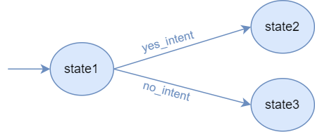

Transitions
===========

Transitions define the connections between agent :doc:`states <states>` and how/when are they triggered.

A transition is a rule that says that the agent must move from a source state to a destination state when some event
and/or condition occurs.

.. warning::

    Transitions' order matters! The order in which a state's transitions are created is the order in which they will be
    evaluated.

In this section, we will explain how to create transitions and the various methods available for creating predefined transitions in an easy way.

.. note::

    Transitions of a session current state are evaluated periodically every N seconds. You can set N as an agent property.
    See the :any:`agent properties <properties-agent>`.

    Whenever a session receives an incoming event, transition evaluation is also run.

Let's say we have the following agent:

.. code:: python

    agent = Agent('example_agent')

    state1 = agent.new_state('state1', initial=True)
    state2 = agent.new_state('state2')
    state3 = agent.new_state('state3')
    ...

Transition Builder
------------------

To help us define a full transition, we use a :class:`~besser.agent.core.transition.transition_builder.TransitionBuilder`
object that will add each element to the transition for us.

Essentially, a Transition Builder has 3 elements:

- **Source**: the source state of the transition we want to build
- **Event**: the event that should trigger the transition **(optional)**
- **Condition**: the condition that should trigger the transition **(optional)**

If both event and condition are specified, both need to be fulfilled in order to trigger the transition. If none of them
is specified, the transition will always be triggered without restrictions.

Fortunately, BAF provides you with functions that abstract you of these concepts.

Let's see an example transition that should be triggered when a ReceiveMessageEvent is sent to the agent from state1:

.. code:: python

    from besser.agent.library.transition.events.base_events import ReceiveMessageEvent
    ...

    event = ReceiveMessageEvent()

    transition_builder: TransitionBuilder = state1.when_event(event)

This will create an (incomplete) transition builder. We still need to specify the destination state:

.. code:: python

    transition_builder.go_to(state2)

That's it! The transition has been already registered into the agent.

**In practice, you will define both the event and the destination state in the same code line:**

.. code:: python

    state1.when_event(event).go_to(state2)

.. note::

    You can leave the event argument empty to match any incoming event (a **"wildcard"** event):

    .. code:: python

        state1.when_event().go_to(state2)

If you want to **add a condition** to the transition, you can do so in the same line of code:

.. code:: python

    state1.when_event(event).with_condition(some_condition).go_to(state2)

You can also **add multiple conditions** to the same transition (so all of them will be merged into a single one)

.. code:: python

    state1.when_event(event).with_condition(condition1).with_condition(condition2).go_to(state2)

It is also possible to define a transition **only with condition (without event)**:

.. code:: python

    state1.when_condition(some_condition).go_to(state2)

Let's quickly explain events and conditions.

Events
~~~~~~

An agent can receive events through its platforms. An agent can define transitions from one state to another based
on the **reception of specific events**.

In the :doc:`Events wiki <events>` page you will find more details about all available events.

.. _transition-conditions:

Conditions
~~~~~~~~~~

A condition is simply **a Python function that returns a boolean value** (i.e., True or False). When returning true, we say
the condition is satisfied (which is the requirement of a condition-based transition to be triggered).

A condition function only has an **argument of type Session** (i.e., the session of the current user, similar to the session parameter
of a state body). This way, conditions can read/write data on the user session.

Let's see it with an example. Let's assume that some agent states update a session variable called 'count'. We can
define a condition that will be satisfied when 'count' is greater than 3:

.. code:: python

    def my_condition1(session: Session):
        return session.get('count') > 3

Now, we can add our condition to a transition:

.. code:: python

    state1.when_condition(my_condition1).go_to(state2)

Optionally, a condition can have **a second argument of type dictionary, where you can store some parameters**. This way,
we can reuse the same condition function with different data:

.. code:: python

    def my_condition2(session: Session, params: dict):
        return session.get('count') > params['target_count']

    state1.when_condition(my_condition2, params={'target_count': 3}).go_to(state2)
    state1.when_condition(my_condition2, params={'target_count': 5}).go_to(state3)

Finally, let's see another way to implement equivalent conditions with **lambda functions**.

.. code:: python

    my_condition1 = lambda session: session.get('count') >= 3
    my_condition2 = lambda session, params: session.get('count') >= params['target']

We can also define **time-based conditions**. Let's see an example:

.. code:: python

    from datetime import datetime
    ...

    def time_condition(session: Session, params: dict):
        # Returns true if the current date is after a target date
        return datetime.now() > params['target_date']

    state1.when_condition(time_condition, params={'target_date': datetime(2025, 7, 3)}).go_to(state2)

Built-in transitions
--------------------

BAF provides some default built-in transitions you can use in your agents without having to manually implement events or condition.

Here we describe each of them.

Intent Matching
~~~~~~~~~~~~~~~

When the user sends a message to the agent, it gets the user intent and uses it to decide which state to move to. When the
user intent matches with a specified transition intent, the agent moves to that transition's destination state.

It uses the :class:`~besser.agent.library.transition.events.base_events.ReceiveTextEvent` and
:class:`~besser.agent.library.transition.conditions.IntentMatcher` condition.

.. code:: python

    state1.when_intent_matched(yes_intent).go_to(state2)
    state2.when_intent_matched(no_intent).go_to(state3)

Visually, this would be the agent architecture:

You can also define where to go when none of the previous intents is matched:

.. code:: python

    state1.when_no_intent_matched().go_to(state4)

Note **that there is the possibility that the agent cannot transition to any state**. For example, if we do not define the
last transition, when neither yes_intent nor no_intent are matched the agent would not know where to move.
In that scenario, the agent would run the state1's fallback body, without moving to another state
(see :any:`state-fallback-body` for more info).
Thus, it is up to the agent creator to choose whether, in case no intent is matched, a transition to another state takes place or not.

Session variables
~~~~~~~~~~~~~~~~~

We can define transitions that take a session variable and applies some operator to compare it with a target value.
In the previous section we saw how to manually create such conditions, but here you will see how to do it with the built-in transitions.

This transition uses the :class:`~besser.agent.library.transition.conditions.VariableOperationMatcher` condition (and no event).

.. code:: python

    import operator # You can import a set of predefined operations from here (or define your own)
    state1.when_variable_matches_operation('money', operator.lt, 10000).go_to(state2)

The operator is a Python function that takes the session variable and the target value as arguments and returns a boolean value.

One must be cautious when defining these transitions. Following the previous example, when this transition is evaluated,
there must be a 'money' variable in the session (that has to be added in some state body), otherwise this transition
will never be triggered.

File reception
~~~~~~~~~~~~~~

It is also possible to trigger a transition in case a file is sent to the agent

It uses the :class:`~besser.agent.library.transition.events.base_events.ReceiveFileEvent`.

.. code:: python

    state1.when_file_received(allowed_types=["application/pdf", "image/png"]).go_to(state2)

Note that it is also possible to define a list of allowed file types, so we can impose
restrictions to what can be sent by users to avoid unwanted file types to be processed. Don't add this parameter if you
want to receive any kind of file.

Automatic transitions
~~~~~~~~~~~~~~~~~~~~~

Another simple but useful kind of transition is the automatic transition. When a state finishes the execution of its
body, if it has an automatic transition the agent will always move to the transition's destination.

This is really useful when, after a sequence of states, we want to automatically return to the starting point of the
conversation.

This transition has no event nor condition (therefore, being always satisfied)

.. code:: python

    state1.go_to(state2)

.. warning::

    The automatic transition cannot be combined with other transitions in the same state.

API References
--------------

- Agent: :class:`besser.agent.core.agent.Agent`
- Agent.new_state(): :meth:`besser.agent.core.agent.Agent.new_state`
- ReceiveMessageEvent: :class:`besser.agent.library.transition.events.base_events.ReceiveMessageEvent`
- Session: :class:`besser.agent.core.session.Session`
- Session.get(): :meth:`besser.agent.core.session.Session.get`
- State: :class:`besser.agent.core.state.State`
- State.go_to(): :meth:`besser.agent.core.state.State.go_to`
- State.when_condition(): :meth:`besser.agent.core.state.State.when_condition`
- State.when_event(): :meth:`besser.agent.core.state.State.when_event`
- State.when_intent_matched(): :meth:`besser.agent.core.state.State.when_intent_matched`
- State.when_no_intent_matched(): :meth:`besser.agent.core.state.State.when_no_intent_matched`
- State.when_variable_matches_operation(): :meth:`besser.agent.core.state.State.when_variable_matches_operation`
- TransitionBuilder: :class:`besser.agent.core.transition.transition_builder.TransitionBuilder`
- TransitionBuilder.go_to(): :meth:`besser.agent.core.transition.transition_builder.TransitionBuilder.go_to`
- TransitionBuilder.with_condition(): :meth:`besser.agent.core.transition.transition_builder.TransitionBuilder.with_condition`
