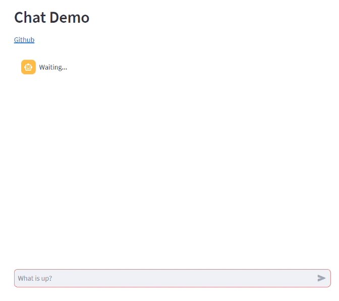

Streamlit UI
============

We provide a Streamlit UI implementing a WebSocket client to communicate with the agent.

This is how our agent UI looks like:

How to use it
-------------

You can run it directly from the agent, by setting it in the websocket_platform:

.. code:: python

    agent = Agent('example_agent')
    ...
    websocket_platform = agent.use_websocket_platform(use_ui=True)

Or you can also run it separately. Just open a terminal on the streamlit UI directory, and run:

.. code:: bash

    streamlit run --server.address localhost --server.port 5000 streamlit_ui.py agent_name localhost 8765

Enabling session persistence
----------------------------
To enable session persistence when using the Streamlit UI, you first need to have the :doc:`monitoring database <../../db/monitoring_db>` running and configured in your agent.
Secondly, you'll need to configure a streamlit database connection in the agent configuration file with the properties described in :any:`Streamlit_Database <properties-streamlit_database>`.
Note that, the streamlit database and monitoring database can be the same. 

Finally, you need to set the ``authenticate_users=True`` parameter when initializing the WebSocket platform:

.. code:: python

    agent = Agent('example_agent', persist_sessions=True)
    ...
    websocket_platform = agent.use_websocket_platform(use_ui=True, authenticate_users=True)

 This allows the platform to authenticate users and maintain their sessions across agent restarts.
